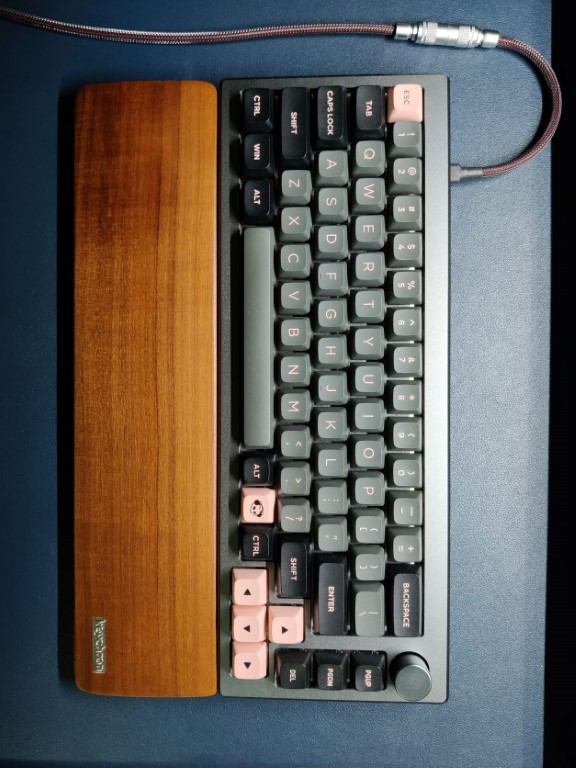

## Akko Mod 008

author: sanket sonavane
create date: 2023-01-10
article state: in-progress

  
> Hello! Dear Visitor the site is now migrated to [sanketsjournal.com](https://www.sanketsjournal.com).   
> It has a better design, dark mode, article search and category pages.   
> All my findings and latest adventures will be published on the new address.    
> Hope you enjoy the new experience.  

  

**keyboard chassis:** 
[akko mod 008](https://en.akkogear.com/product/mod-008/)

**switches:**
[akko cs jelly black](https://en.akkogear.com/product/akko-cs-jelly-black-switch-45pcs/) factory hand lubed
Type: Linear
Actuation Force: 50gf ± 5gf
Total Travel: 4.0 ± 0.3mm
Pre-Travel: 1.9 ± 0.3mm

[gateron ink black v2](https://www.gateron.co/products/gateron-ink-switch?variant=40018061590617)
Operation Force: 60±15 gf
Pre-Travel: 1.2±0.3 mm
Total Travel: 3.4+0.0/-0.4 mm
Operation Life: Up to 60M cycles
Finger Strike Feeling: Vertical, moderate pressing force, clear rebound

**keycaps:**
[akko black and pink](https://en.akkogear.com/product/blackpink-keycap-set-158-key/)

**cable:**
[straight cable from kushcables](https://kushcables.com/products/commissiondesign-your-own-cable)
red base and black sleeve with black shrinkwraps
connector : YC8 chrome 
usb-a to usb-c gold plated

**wrist rest:**
[keychron q1 wooden](https://www.keychron.com/products/keychron-keyboard-wooden-palm-rest)
330 x 80 x 15 mm

